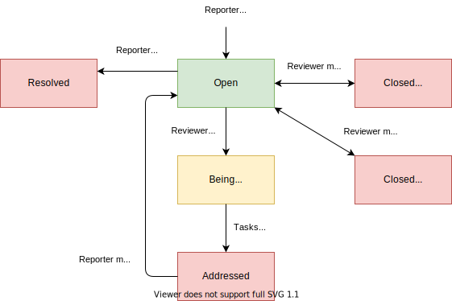
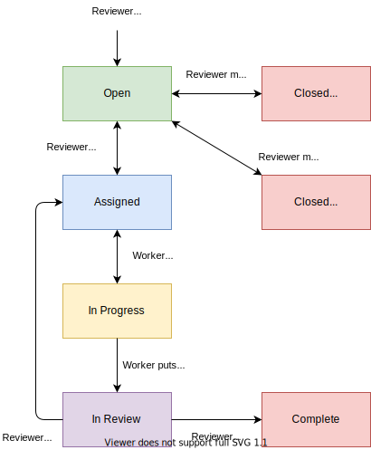

# TaskRoller
###### Issue and Task Manager

[](https://circleci.com/gh/dsandstrom/task_roller)

[](https://github.com/dsandstrom/task_roller/actions?query=workflow%3ARubocop)

## Introduction
TaskRoller is an issue tracking app with the added ability to assign tasks to address your projects' bugs and feature requests.

## Technologies
* Built using Ruby on Rails, JavaScript, HTML, and CSS.
* Uses [devise](https://github.com/heartcombo/devise) and [OmniAuth](https://github.com/omniauth/omniauth) which allows logging in with a GitHub account
* GitHub API Integration: allows connecting to a repo's issues and automation using git commit messages.

## Issues & Tasks
_Issues_ are opened to report problems, offer suggestions, and ask questions. While _Tasks_ are created to address problems or add features. Both follow _Workflows_ that set the _Status_ and provide information. Issues and Tasks both reside in _Projects_, which are organized into _Categories_. In addition, collaboration is encouraged with markdown enabled comments.

## User Account Levels
User accounts are organized by levels to allow a focus on responsibilities and add security. Here is a short description of each:

#### Admins
One or two people responsible for the initial app setup and user management. They have the same abilities as Reviewers, but they can also edit/remove other people's issues, tasks, comments, etc.

#### Reviewers
Project managers. They can do some app setup like create Categories and Projects. However, their main responsibility is managing issues and tasks.

#### Workers
The busy bees working on tasks. In addition, they can report issues and self-assign tasks.

#### Reporters
Everyone else can open issues, add comments, and see activity.

## Workflows

### Issue Status Workflow
Issues can have five statuses: _Open_, _Being Worked On_, _Addressed_, _Resolved_, and _Closed_. Here is the basic status workflow:



### Task Status Workflow
Tasks can have six statuses: _Open_, _Assigned_, _In Progress_, _In Review_, _Complete_, and _Closed_. Here is the basic status workflow:



## Issue & Task Types
This part is up to you and must be added initially by an Admin.  However, it's easy, just enter a name and pick one of the available colors and icons. For issues, I suggest: "Bug", "Suggestion", and "Question". For tasks: "Bug", "Improvement", and "Feature Request".


## GitHub API Integration

Connect your TaskRoller app to a GitHub repo to simplify things:
* When a new issue is added on github.com, an Issue is added to your TaskRoller app.
* Tasks can be created from this Issue, which can be progressed with commit message callouts.
* When the TaskRoller Issue is closed, the issue on GitHub is also closed.
* Automated comments are added to the GitHub issues which provide info and links.

### Commit Message Callouts

* Start/Progress -> Start working on Task
* Pause -> Pause working on task
* Fix/Close/Complete -> Mark Issue is ready for review

### Example Commit Message
```
Fix the widget color

This commit fixes the color of the widgets.

Fixes Task#12
```

When a callout is added last in a commit message. It is picked up by TaskRoller and updates the corresponding Task.  For the above example, it will mark Task#12 done and ready for review. In addition, different callout formats and tenses are allowed. These all perform the same action: `Fix Task 12`, `Completed Task #12`, `completes task-12`

## Options
* App can be set to allow anyone to sign up or limited to invite only.

## Live App
Please feel free to check out a [live version](https://production.task-roller.net) of the app. It houses issues and tasks for this app and connected to this [GitHub repo](https://github.com/dsandstrom/task_roller).

## Local Setup

#### System dependencies
* Ruby
* rbenv, rvm, or similar
* PostgreSQL

#### Configuration

##### Install Ruby, Rails, and gems

Clone from GitHub and `cd` into project directory

```sh
# install ruby version set in .ruby-version
rbenv install # or `rvm install`
gem install bundler
bundle install --without production
```

#### Install Frontend Dependencies
Install [yarn](https://github.com/yarnpkg/yarn) on your system. This step might
also install Node.js, but please see below to ensure that you use the right
version when working on the project.

I use [Node Version Manager](https://github.com/nvm-sh/nvm) to maintain a more
consistent Node.js version. The version number is stored in *./.nvmrc*. Please
use that version of node or use **nvm** to install it.

```sh
# using nvm
# cd into project directory
nvm install
nvm use

# finally, install packages
yarn install
```

#### Setup secrets
Environment variables are used to store passwords and tokens. The gem [dotenv-rails](https://github.com/bkeepers/dotenv) is used in test and development environments. An example file is included in the repo that shows the key options.  For production, set variables when running the app.

* Rename `.env.example` to `.env` and add the real values
#### Database creation/initialization

```sh
bin/rails db:setup
```

#### How to run the test suite

```sh
bin/rails rspec spec/
```

#### Services (job queues, cache servers, search engines, etc.)

I use guard to automate local development
```sh
bundle exec guard -g backend # start rspec and bundler watchers
bundle exec guard -g frontend # start server (port 3000) and livereload watcher
```

## App Hosting
The app is open source and you are free to run on your on own servers. However, database/web hosting and custom features can be provided with a moderate fee. Please contact darrell@task-roller.net if interested.
