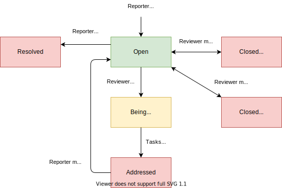

# Task Roller
###### Issue and Task Manager

[](https://circleci.com/gh/dsandstrom/task_roller)

[](https://github.com/dsandstrom/task_roller/actions?query=workflow%3ARubocop)

## User Types
There are four available user types. Here is a short description of each:

#### Admins
One or two people responsible for the initial app setup and user management.
They have the same abilities as Reviewers, but they can also edit/remove other
people's issues, tasks, comments, etc.

#### Reviewers
Project managers. They can do some app setup like create Categories and
Projects. However, their main responsibility is managing issues and tasks.

#### Workers
The busy bees working on tasks. In addition, they can report issues and self-assign
tasks.

#### Reporters
Everyone else can open issues and see activity.

## Issue & Task Types
This part is up to you and must be added initially by an Admin.  However,
it's easy, just enter a name and pick one of the available colors and icons.
For issues, I suggest: "Bug", "Suggestion", and "Question". For tasks: "Bug",
"Improvement", and "Feature Request".


## Workflows

#### Issue Status Workflow
Anyone can create issues, however Reviewers are responsible for opening tasks
to address them. Here is the basic status workflow:



#### Task Status Workflow
Reviewers can create tasks, either to address an issue or completely separate.
Here is the basic status workflow:


## Local Setup

#### System dependencies
* Ruby
* rbenv, rvm, or similar
* PostgreSQL

#### Configuration

##### Install Ruby, Rails, and gems

Clone from GitHub and `cd` into project directory

```sh
# install ruby version set in .ruby-version
rbenv install # or `rvm install`
gem install bundler
bundle install --without production
```

#### Install Frontend Dependencies
Install [yarn](https://github.com/yarnpkg/yarn) on your system. This step might
also install Node.js, but please see below to ensure that you use the right
version when working on the project.

I use [Node Version Manager](https://github.com/nvm-sh/nvm) to maintain a more
consistent Node.js version. The version number is stored in *./.nvmrc*. Please
use that version of node or use **nvm** to install it.

```sh
# using nvm
# cd into project directory
nvm install
nvm use

# finally, install packages
yarn install
```

#### Setup secrets

```sh
bin/rails secrets:edit
```

* Copy config/secrets.yml.example and paste in open window
* Add secret key bases (Use `bin/rails secret` to generate them)
* Set db username and password to match your PostgreSQL database

#### Database creation/initialization

```sh
bin/rails db:setup
```

#### How to run the test suite

```sh
bin/rails rspec spec/
```

#### Services (job queues, cache servers, search engines, etc.)

I use guard to automate local development
```sh
bundle exec guard -g backend # start rspec and bundler watchers
bundle exec guard -g frontend # start server (port 3000) and livereload watcher
```

#### Deployment instructions

WIP
